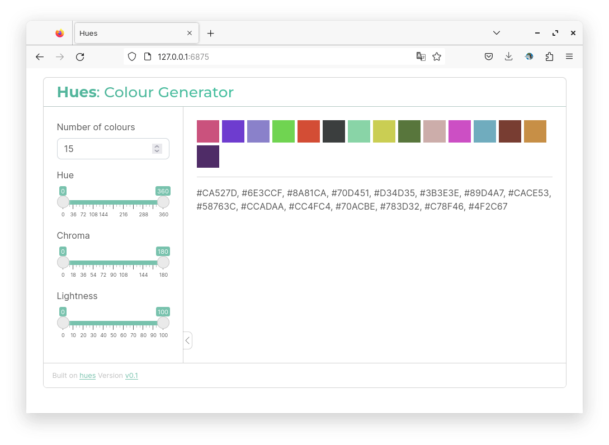

# shiny-hues

[](https://github.com/royfrancis/shiny-hues/actions?workflow=build) [](https://hub.docker.com/repository/docker/royfrancis/shiny-hues)

A shiny app to generate distinct colours.



## Running the app

### Run online

Click [here](https://hues.serve.scilifelab.se/) to access an online instance of this app. This link may not always be active.

### Run using docker

```
docker run --rm -p 3838:3838 royfrancis/shiny-hues:latest
```

The app should be available through a web browser at `http://0.0.0.0:3838`.

### Run in R

Install the following R packages:

```
install.packages(c("pak"),repo="https://cloud.r-project.org/")
pak::pkg_install("rstudio/bslib")
pak::pkg_install("johnbaums/hues")
```

This repo is not an R package. Clone this repo and execute the R command `shiny::runApp("app.R")` in the root directory.

## Acknowledgements

Built on the [hues package](https://github.com/johnbaums/hues).

---

2024 • Roy Francis
